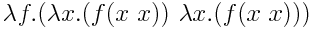

# Y-Combinator-Impl

This is my implementations of the Y-Combinator in different programming languages. The Y-Combinator is a way to make recursive functions in programming languages which does not support it. It was discovered by [Haskell B. Curry](https://en.wikipedia.org/wiki/Haskell_Curry) and defined using [Lambda Calculus](https://en.wikipedia.org/wiki/Lambda_calculus).

## Inspiration
I learned about the Y-combinator when watching the [Computerphile](https://www.youtube.com/user/Computerphile) video about the [Wikipedia](https://en.wikipedia.org/wiki/Fixed-point_combinator) after watching their video about [Lambda Calculus](https://en.wikipedia.org/wiki/Lambda_calculus).. I did not quite understand it at first. Therfore I decided to try and implement it to get a better understand it

## Programming languages
- [x] Javascript
- [x] Elisp
- [x] Python
- [ ] Haskell
- [ ] Rust
- [ ] Scheme
- [ ] Java
- [ ] C

## More information
Good places to learn more about the Y-Combinator:
- [Wikipedia](https://en.wikipedia.org/wiki/Fixed-point_combinator)
- [Computerphile](https://www.youtube.com/user/Computerphile) videos
  - [Lambda Calculus](https://www.youtube.com/watch?v=eis11j_iGMs)
  - [Y-combinator](https://www.youtube.com/watch?v=9T8A89jgeTI)
- [Talk: Fun with Lambda Calculus](https://www.youtube.com/watch?v=QPqoFCHpLF4)
- [Talk: Advendures in functional programming](https://www.youtube.com/watch?v=QPqoFCHpLF4)
- [Website: Explained with Javascript](http://kestas.kuliukas.com/YCombinatorExplained/)
